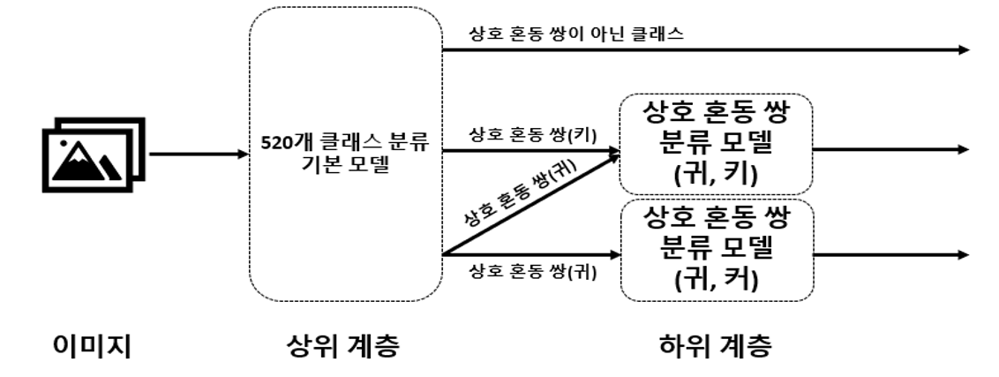
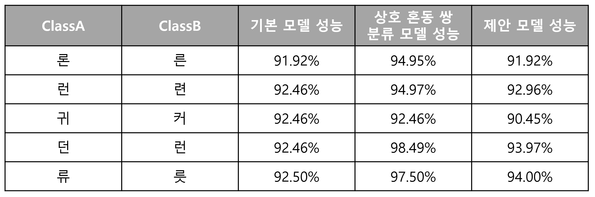

# mutually_confused_pairs

### Summary
이번 연구는 유사한 특징을 가져 모델이 구분을 어려워하는 클래스들(치타,표범 / 귀,키 / 강,감 등)을 모델로부터 자동으로 선정하고, 이를 이용하여 모델의 분류 성능 향상을 목표로 한다.

다양한 클래스들 중 특정 두 클래스가 유사한 특징을 가져 구분이 어려운 클래스를 상호 혼동 쌍이라고 정의한다.

딥 러닝 모델을 통해 선정된 상호 혼동 쌍이 유의미한지 알아보기 위해 계층적 딥 러닝 모델을 구성하고, 계층적 딥 러닝 모델에서 이미지 분류 성능이 향상되었음을 확인한다.

### Dataset

이번 연구는 한글 필기체 이미지(Seri95a)를 사용하였으며 [데이터셋](https://github.com/callee2006/HangulDB)의 특징은 다음과 같다.

{: width="50%" height="100%"}
{: width="50%" height="50%"}

### Method

실험은 다음과 같이 이루어졌다.

1. 딥 러닝 모델으로 전체 데이터셋을 학습한다. 학습하는 과정에서 데이터셋에 대한 모든 예측값을 저장한다. 
2. Memorization 현상이 나타나기전 까지의 Epoch결과값을 이용하여 Confusion Matrix를 구성하고 상호 혼동 쌍을 선정한다.
3. 선정된 상호 혼동 쌍만을 학습한다.
4. 전체 데이터셋을 학습한 모델 하위 계층에 3번 모델을 덧붙인다.

### Result

[실험 결과]
모든 경우에 성능이 향상되는 것은 아니였으나, 대부분의 경우 성능이 향상되었다.
성능이 떨어진경우는 1대N관계의 혼동이 존재할것으로 추측하며, 계층적 구조가 아닌 학습과정에서 상호 혼동 쌍을 이용한다면 이번 연구의 제안 모델보다 성능을 더 향상시킬 수 있을 것으로 예상한다.
또한 이 연구는 향후 Noise Labeled된 데이터를 수정하는 기술 등에 사용될 수 있을것으로 기대한다.

논문 : [LINK](http://www.riss.kr/link?id=T15488331)
